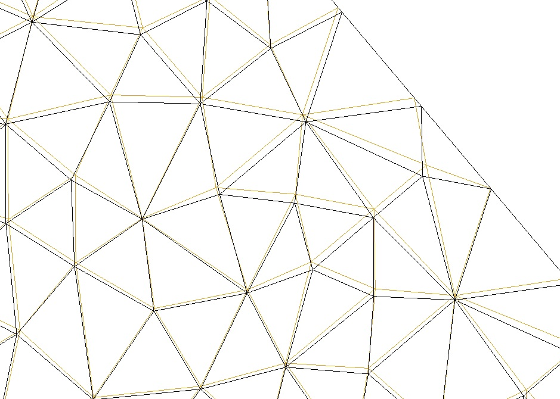

# MeshKernel
[](https://sonarcloud.io/dashboard?id=Deltares_Grid_Editor_back-end)

Deltares C++ library for creating and editing 2D unstructured and curvilinear meshes.

The library is separated in an API namespace (MeshKernelApi), used for communication with the client and a backend namespace (MeshKernel), where the algorithms are implemented. 
The API namespace contains several structures used as parameters for the API methods (see API usage section). 
These structures must be mirrored in the client application and filled with appropriate values.

## Build

The requirements are:
- CMake 3.14 or higher
- A C++11 compatible compiler
- The Boost libraries
- Git
- Doxygen (optional)


On windows precompiled boost binaries (with MSVC compiler) can be downloaded here:

https://sourceforge.net/projects/boost/files/boost-binaries/ 

Once installed, modify boost environmental variables accordingly. For example:
```powershell
BOOST_INCLUDEDIR=C:\Apps\boost_1_70_0
BOOST_LIBRARYDIR=C:\Apps\boost_1_70_0\lib64-msvc-14.1
```
### IDE
To use an IDE, such as Visual Studio:

```powershell
cmake -S . -B xbuild -G"Visual Studio 16 2019"
cmake --open xbuild
```
### Command line
To configure:
```powershell
cmake -S . -B build
```

To build:
```powershell
cmake --build build
```

To build docs (requires Doxygen, output in `build/docs/html`):
```powershell
cmake --build build --target docs
```


## Examples

1. Creating a triangular mesh inside a polygon

In this example a mesh is created by discretizing the polygon perimeter with the desired edge length


2. Mesh orthogonalization

Finite volume staggered flow solvers require the mesh to be as much orthogonal as possible. 
MeshKernel provides an algorithm to adapt the mesh and achieve a good balance between mesh orthogonality and smothness.



3. Curvilinear mesh generation

Curvilinear meshes for rivers can be generated using splines.


4. Mesh refinement

A mesh can be refined in areas based on samples or polygon selections 


